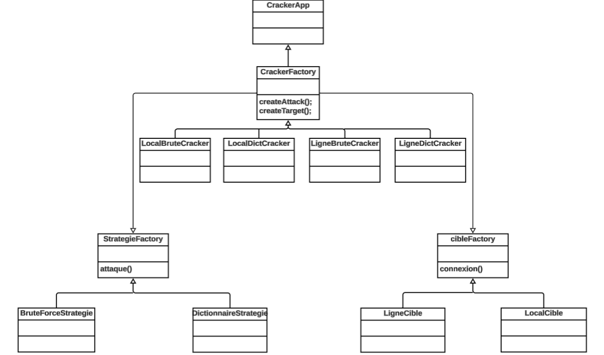
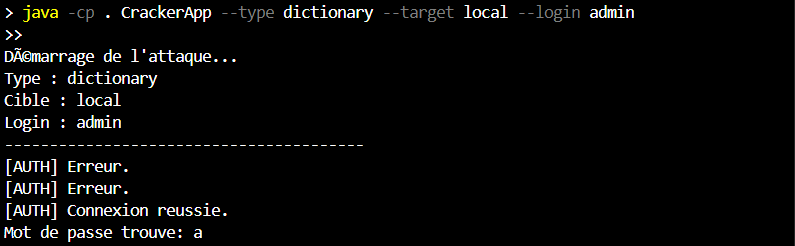

# Password Cracker Factory

## Présentation
Un mini-projet Java qui simule une **attaque de mots de passe** à l'aide de deux stratégies : 
- Brute Force 
- Dictionnaire. 

L'application cible peut être : 
- Un système **local**
- Un formulaire en ligne (**PHP**)

---

## Architecture du projet
```
PasswordCracker/
├── AppliCracker/
│   ├── BruteForceStrategie.java
|   ├── cibleFactory.java
|   ├── CrackFactory.java
|   ├── CrackerApp.java
|   ├── DictionnaireStrategie.java
|   ├── LigneBruteCracker.java
|   ├── LigneCible.java
|   ├── LigneDictCracker.java
|   ├── LocalAuthenticator.java
|   ├── LocalBruteCracker.java
|   ├── LocalCible.java
|   ├── LocalDictCracker.java
|   ├── StrategieFactory.java
│
├── CiblePHP/
│   ├── login.php
│   ├── dashboard.php
│   ├── logout.php
│
├── Dictionnaire/
│   └── rockyou.txt
│
├── captures/
│   ├── essai.png
│   └── image.png
│
├── .gitignore
└── README.md
```
>  **Remarque importante sur le dossier `cible/` :**  
> Le dossier `cible/` contient des copies statiques des fichiers PHP (`login.php`, `logout.php`, `dashboard.php`) qui simulent la cible en ligne.  
> Ces fichiers **ne sont pas exécutables directement** et **ne sont pas connectés au code Java**.  
> Ils ont été ajoutés uniquement **à des fins de démonstration** dans ce dépôt GitHub.  
> En réalité, la cible PHP utilisée pendant les tests est hébergée en local dans le dossier suivant :


---

## Principes de conception

### Diagramme De Classe


### Design Pattern : Factory Method
Nous avons utilisé le **pattern Factory Method**, qui permet d’instancier dynamiquement des objets sans avoir à connaître leur classe exacte au moment de l’écriture du code.

Dans notre projet, la classe principale `CrackerApp` ne crée **ni les cibles** (locales ou en ligne), **ni les stratégies d’attaque** (force brute ou dictionnaire) elle-même. Elle délègue cette responsabilité à des **factories**, selon les arguments passés en ligne de commande.

Ce pattern est particulièrement adapté ici car :
- On ne crée qu’**un seul objet à la fois** (stratégie ou cible), et non une famille d’objets liés.
- On veut **éviter les `if` ou `switch` répétitifs** dans le code principal.
- On facilite l’**extension du projet** : ajouter une nouvelle stratégie ou une nouvelle cible ne nécessite pas de modifier `CrackerApp`.

Contrairement au **pattern Abstract Factory**, qui est conçu pour créer des **familles entières** d’objets compatibles, notre besoin ne concerne que des **objets uniques et interchangeables**. C’est pourquoi **le pattern Factory Method est le plus approprié** dans notre cas.

### Stratégies interchangeables
Les stratégies d’attaque implémentent l’interface `StrategieFactory` pour faciliter l’extension.

### Cibles modulables
Le projet peut facilement être étendu pour d'autres types de cibles (API, fichier, base de données...).

### Variantes implementees
Le projet implémente **4 variantes d’attaque** grâce à la combinaison des stratégies et des cibles :

| Variante | Stratégie     | Cible       | Classe utilisée                  |
|----------|----------------|-------------|----------------------------------|
| 1        | Brute Force    | Locale      | `LocalBruteCracker`              |
| 2        | Dictionnaire   | Locale      | `LocalDictCracker`              |
| 3        | Brute Force    | En ligne    | `LigneBruteCracker`             |
| 4        | Dictionnaire   | En ligne    | `LigneDictCracker`              |

Ces variantes sont choisies **automatiquement** par `CrackerApp` en fonction des arguments passés en ligne de commande.

---

## Arguments disponibles
| Argument        | Description                                           | Exemple             |
|-----------------|-------------------------------------------------------|---------------------|
| `--type`        | Type d’attaque (`brute_force` ou `dictionnaire`)      | `--type brute_force`|
| `--target`      | Cible (`local` ou `online`)                           | `--target local`    |
| `--login`       | Identifiant à attaquer                                | `--login admin`     |

---

## Fonctionnement
L’utilisateur lance l’application `CrackerApp` avec des arguments de ligne de commande pour spécifier :
- La **stratégie d’attaque**
- Le **type de cible**
- Le **login à attaquer**

### Commande
```bash
java CrackerApp --type brute_force --target local --login admin
```

---

### Extrait de résultat attendu


---

## Pistes d'amélioration
- Ajouter une interface graphique pour faciliter le choix des options.
- Enregistrer les essais et le temps d'exécution pour analyser les performances.
- Hacher les mots de passe dans `LocalAuthenticator` pour simuler un vrai système sécurisé.
- **Permettre à l'utilisateur de spécifier dynamiquement l’URL cible**, afin de rendre le cracker plus générique et utilisable sur n’importe quel formulaire compatible.
    - Actuellement, l’URL du site ciblé est codée en dur dans `LigneCible.java`.
    - Une extension possible serait d’accepter l’URL comme **paramètre de ligne de commande** ou **dans un fichier de config**.
- Modulariser davantage la gestion des cibles locales et distantes pour supporter plus de scénarios (API REST, fichiers JSON, sockets...).

---

## Auteurs
Projet réalisé par **Fatou Kiné THIOUB**,**Cheikh Ibrahima NDIAYE**, **Coumba FALL**, **Mammadou Makhtar GUEYE**, et **Abdoul Aziz KANE** étudiants en **DIC1** à l’**École Supérieure Polytechnique (ESP)** de l’**UCAD**.

Dans le cadre du module **Patrons de conception**.

---

## Licence
Ce projet est réalisé **à but pédagogique** et n'est pas destiné à une utilisation malveillante.